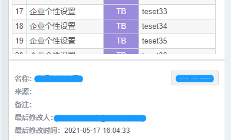

拖拽线，下面的上下内容分区的比例会改变


<!-- more -->

```html
<div ref="topDom" class="containorOuter">上面</div>
<div id="line" ref="moveDom" class="dragLine" />  // 拖拽的线
<div ref="bottomDom" >下面</div>
```

```js
mounted() {
    this.topDom = this.$refs.topDom
    const _this = this
    this.$nextTick(() => {
      const moveDom = document.getElementById('line')
      moveDom.onmousedown = function(e) {
        _this.clientStartX = e.clientY
        document.onmousemove = function(e) {
          _this.moveHandle(e.clientY, _this.topDom)
          return false
        }

        document.onmouseup = function() {
          document.onmousemove = null
          document.onmouseup = null
        }
        return false
      }
    })
  },
  methods: {
    moveHandle(nowClient, topDom) {
      let changeHight = nowClient - 103
      let remainHight = document.body.clientHeight - nowClient
      // 下面两个判断是控制拖动的最大范围，不能完全覆盖
      if (changeHight < 100) {
        changeHight = 100
        nowClient = 100 + 103
        remainHight = document.body.clientHeight - nowClient
      }
      if (remainHight < 100) {
        remainHight = 100
        nowClient = document.body.clientHeight - 100
        changeHight = document.body.clientHeight - 203
      }
      topDom.style.height = changeHight + 'px'
      this.$refs.bottomDom.style.height = remainHight + 'px'
    },
  }
```

```css
// 线的样式
.dragLine {
    height: 2px;
    background: #dcdfe6;
    cursor: row-resize;
}
```

https://blog.csdn.net/u012767761/article/details/82712194  鼠标样式详情