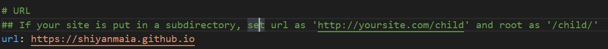

今天想测试使用md加入图片，结果发现路径会出错，后续查百度是说由于hexo的版本升级后导致路径不对，可以使用hexo-asset-image插件来解决这个问题，但是需要修改部分内容。将修改好的仓库代码fork到了自己的git仓库，使用

`npm install https://github.com/shiyanmaia/hexo-asset-image.git --save`

来进行安装，后续发现推送以后如果使用``会导致其导航到另一个奇怪的路径，且使用的是github的绝对路径，经过排查发现是_config.yml的配置错误，其中URL的配置没有配置对

如上图修改正确以后，便可以使用``来引入图片了，还有一种引入图片的官方使用方法是
```markdown

```
还有一点就是不要使用中文路径，虽然经过试验，中文.md也可以正常使用，但是插入图片的话可能会有错误。
