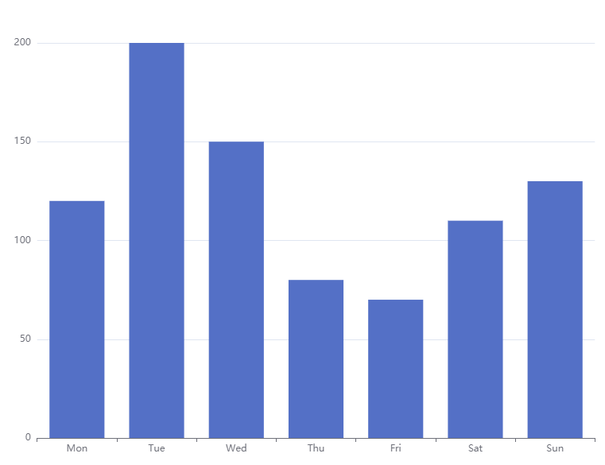
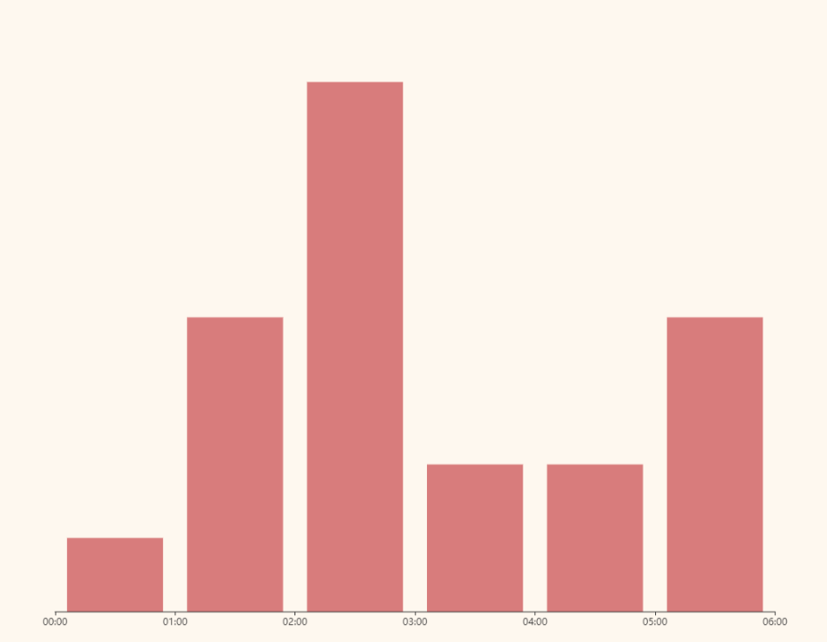

Ecahrt提供的柱状图一般的x轴都在柱形的中间，如下图

<!-- more -->



但是如果是需要让柱形图在x轴数值的区间的话，则可以在echart的xAxis中设置两个数组，一个是使用Y的数组值，这个是相当于对齐中间，另一个是那个区间的数组，一般区间数组要比正常的Y轴多那么一个值，要么最左边，要么最右边。

```js
const xData = ['00:00', '01:00', '02:00', '03:00', '04:00', '05:00', '06:00'];
const barData = [5, 20, 36, 10, 10, 20];

option = {
    tooltip: {
        show: true,
        trigger: 'axis',
        confine: true,
    },
    xAxis: [{
            data: barData,
            show:false
        },
        {
            data: xData,
            axisLabel: {
                interval: 0,
                show: true,
            },
            position: 'bottom',
            boundaryGap: false,
            axisPointer: {
                show: false,
            },
        },
    ],
    yAxis: {
        type: 'value',
        show: false,
    },
    series: [{
        data: barData,
        type: 'bar',
        backgroundStyle: {
            color: 'rgba(220, 220, 220, 0.8)',
        },
    }, ],
}
```

如下图

